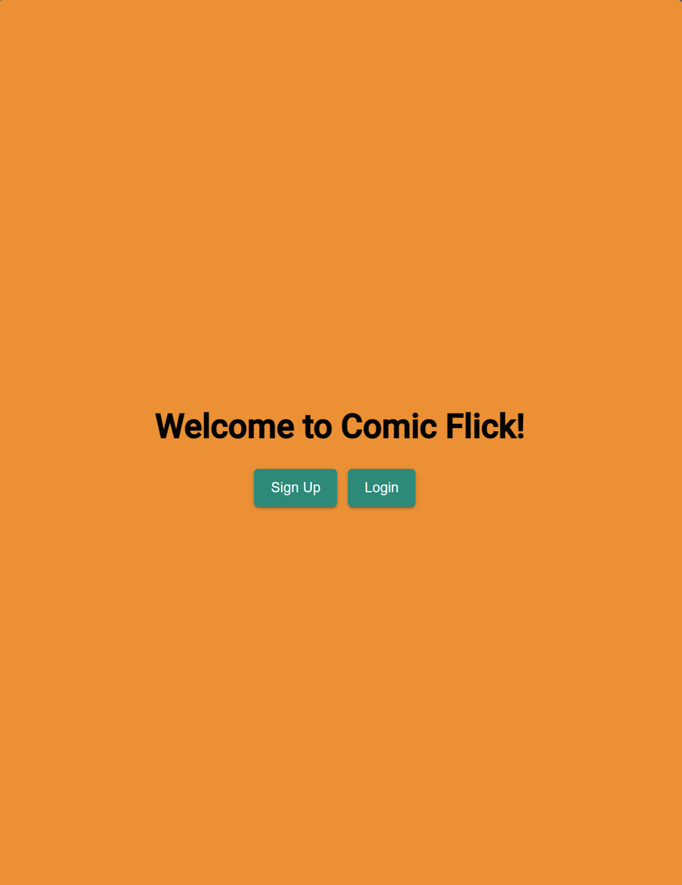

# Comic Flick (Angular)

Comic Flick (Augular) uses Angular to build the client-side for an application called myFlix based on its existing server-side code (REST API and database), with supporting documentation.

  
  

## Tech Used

- Angular
- Node.js and npm package
- Angular Material
- JSDoc
- GitHub Pages

## User Stories

- The user will be able to receive information on movies, directors, and genres so that they can learn more about movies they have watched or are interested in.
- The user will be able to create a profile so they can save data about their favorite movies.
